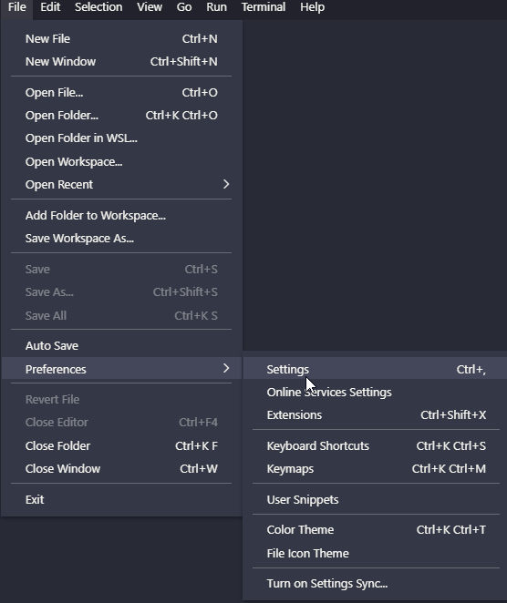
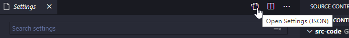
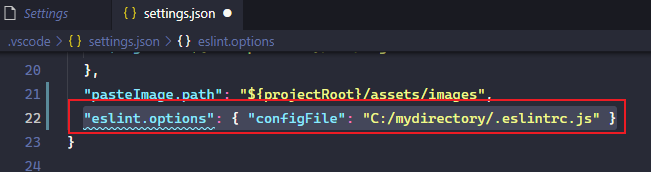
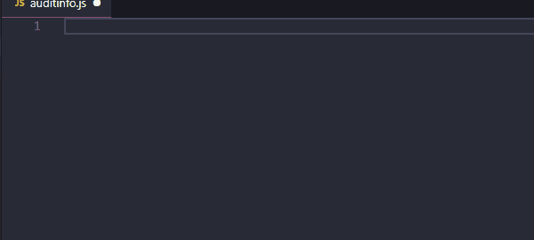
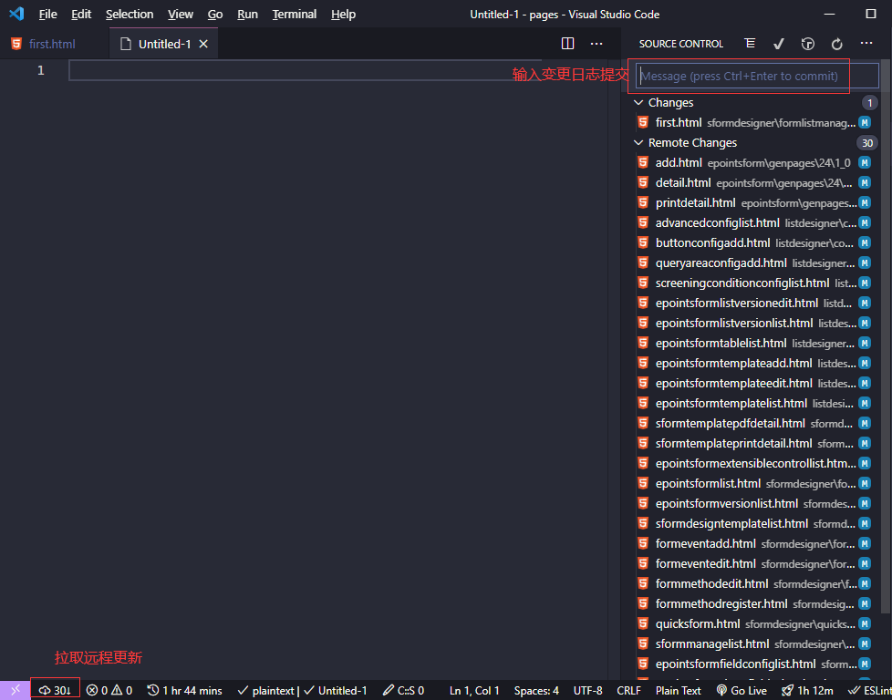
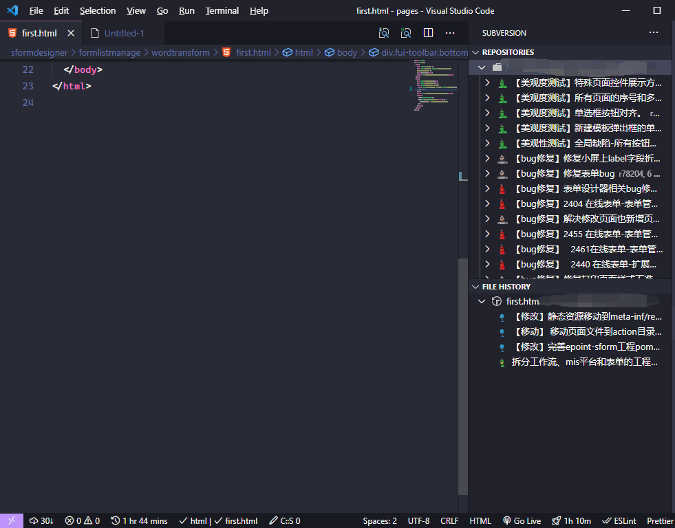

# 新点前端扩展工具包

## 扩展包内容

- [ESLint](https://marketplace.visualstudio.com/items?itemName=dbaeumer.vscode-eslint)
- [Prettier - Code formatter](https://marketplace.visualstudio.com/items?itemName=esbenp.prettier-vscode)
- [Vetur](https://marketplace.visualstudio.com/items?itemName=octref.vetur)
- [Live Server](https://marketplace.visualstudio.com/items?itemName=ritwickdey.LiveServer)
- [Live Sass Compiler](https://marketplace.visualstudio.com/items?itemName=ritwickdey.live-sass)
- 中文语言包[Chinese (Simplified) Language Pack for Visual Studio Code](https://marketplace.visualstudio.com/items?itemName=MS-CEINTL.vscode-language-pack-zh-hans)
- [mini Snippet](https://marketplace.visualstudio.com/items?itemName=littleSean.minisnippet)
- [SVN](https://marketplace.visualstudio.com/items?itemName=johnstoncode.svn-scm)
- [GitLens](https://marketplace.visualstudio.com/items?itemName=eamodio.gitlens)
- [Code Spell Checker](https://marketplace.visualstudio.com/items?itemName=streetsidesoftware.code-spell-checker)
- [vscode-fileheader](https://marketplace.visualstudio.com/items?itemName=mikey.vscode-fileheader)

## 统一配置

**ESLint**

在vscode中配置文件中新增以下记录：

```json
{
  "eslint.options": { "configFile": "C:/mydirectory/.eslintrc.js" }
}
```

注意将 mydirectory 改为 自己放置的目录

<details>
    <summary>详细说明</summary>

eslint 安装

使用如下命令全局安装 eslint

```sh
npm install -g eslint --registry=https://registry.npm.taobao.org/
```

> 需要已经安装nodejs，未安装请前往 [https://nodejs.org/zh-cn/](https://nodejs.org/zh-cn/)下载安装

使用此配置

**方式一：** 单个项目使用

直接将此配置文件拷贝到项目根目录下即可

**方式二：** 全部项目使用

在vscode中配置文件中新增以下记录：

```json
{
  "eslint.options": { "configFile": "C:/mydirectory/.eslintrc.js" }
}
```

注意将 mydirectory 改为 自己放置的目录

操作步骤如下：







</details>

**Prettier**

安装 Prettier 后，加入如下配置

```jsonc
{
  "[json]": {
    "editor.defaultFormatter": "esbenp.prettier-vscode"
  },
  "[less]": {
    "editor.defaultFormatter": "esbenp.prettier-vscode"
  },
  "[scss]": {
    "editor.defaultFormatter": "esbenp.prettier-vscode"
  },
  "[jsonc]": {
    "editor.defaultFormatter": "esbenp.prettier-vscode"
  },
  "[css]": {
    "editor.defaultFormatter": "esbenp.prettier-vscode"
  },
  "[typescript]": {
    "editor.defaultFormatter": "esbenp.prettier-vscode"
  },
  "[javascriptreact]": {
    "editor.defaultFormatter": "esbenp.prettier-vscode"
  },
  "[vue]": {
    "editor.defaultFormatter": "esbenp.prettier-vscode"
  },
  "[javascript]": {
    "editor.defaultFormatter": "esbenp.prettier-vscode"
  },
  "prettier.tabWidth": 2,
  "prettier.jsxBracketSameLine": true,
  "prettier.printWidth": 120,
  "prettier.singleQuote": true,
  "prettier.semi": true,
  "prettier.trailingComma": "none",
  "vetur.format.defaultFormatter.html": "prettier",
  "vetur.format.options.tabSize": 2,
  "vetur.format.defaultFormatterOptions": {
    "prettyhtml": {
      "wrapAttributes": false,
      "printWidth": 120,
      "jsxBracketSameLine": true
    },
    "prettier": { "trailingComma": "none", "jsxBracketSameLine": true }
  }
}
```

## 包工具说明

### [ESLint](https://marketplace.visualstudio.com/items?itemName=dbaeumer.vscode-eslint)

代码检查，请务必按照统一配置中 ESLint 进行配置

### [Prettier - Code formatter](https://marketplace.visualstudio.com/items?itemName=esbenp.prettier-vscode)

代码格式化，请务必按照统一配置中 Prettier 进行配置

### [Vetur](https://marketplace.visualstudio.com/items?itemName=octref.vetur)

vue 开发支持

### [Live Server](https://marketplace.visualstudio.com/items?itemName=ritwickdey.LiveServer)

启动一个本地服务器，修改文件自动刷新浏览器

### [Live Sass Compiler](https://marketplace.visualstudio.com/items?itemName=ritwickdey.live-sass)

观测编译 sass/scss

### [mini Snippet](https://marketplace.visualstudio.com/items?itemName=littleSean.minisnippet)

miniui 代码片段



### [SVN](https://marketplace.visualstudio.com/items?itemName=johnstoncode.svn-scm)

在vscode中使用SVN

提交和更新



查看日志和文件历史记录



### [GitLens](https://marketplace.visualstudio.com/items?itemName=eamodio.gitlens)

强化git的相关功能，如：


更多功能参考其文档。

### [Code Spell Checker](https://marketplace.visualstudio.com/items?itemName=streetsidesoftware.code-spell-checker)

检查单词拼写，防止出现低级错误。

### [vscode-fileheader](https://marketplace.visualstudio.com/items?itemName=mikey.vscode-fileheader)

自动维护文件头部注释


